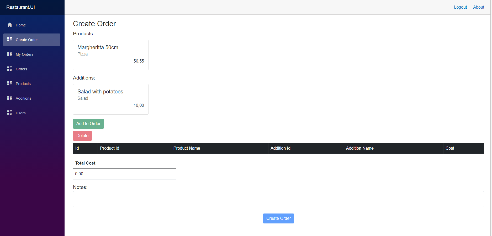
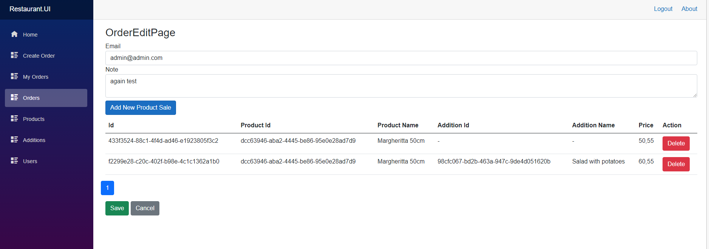
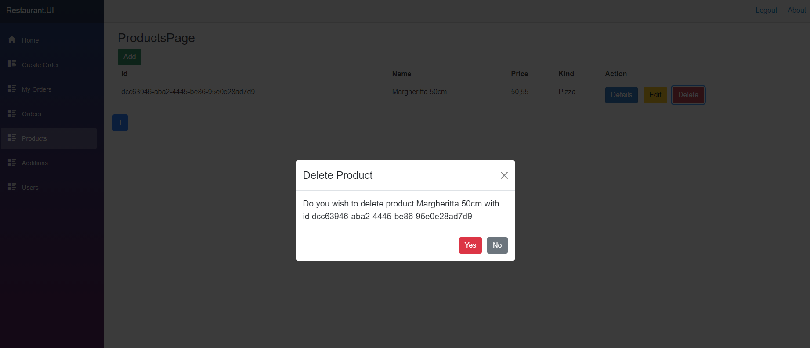
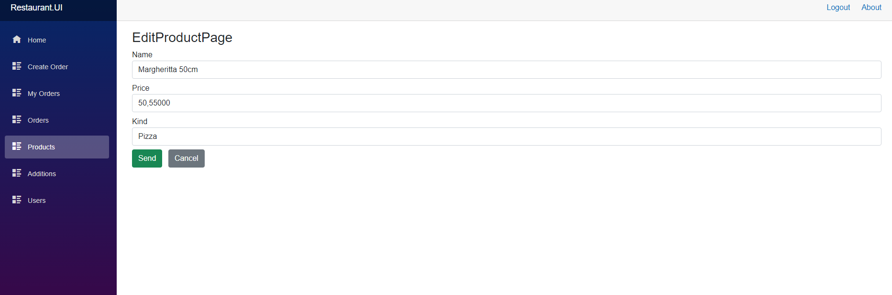
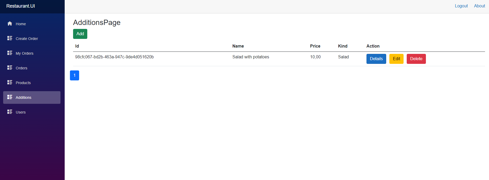
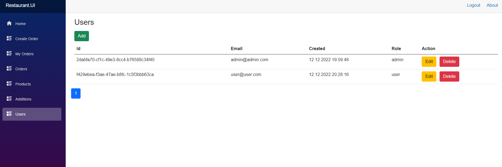
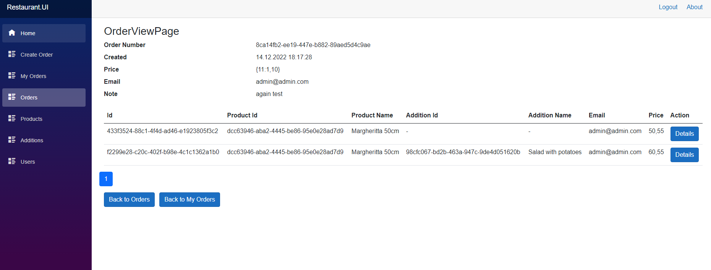
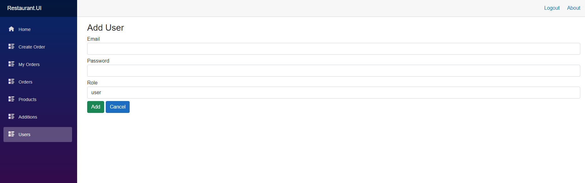
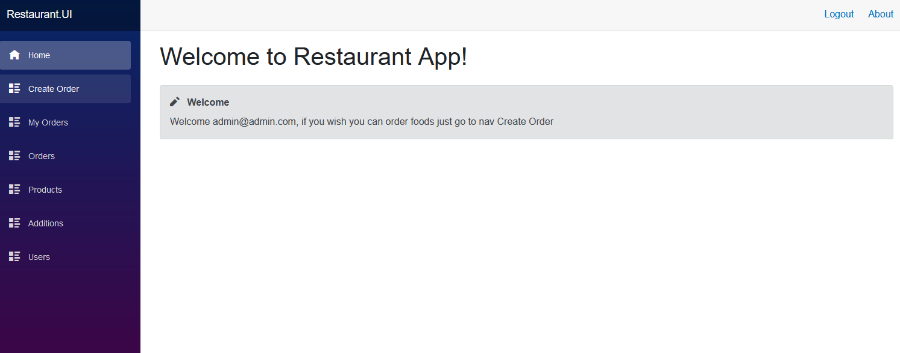
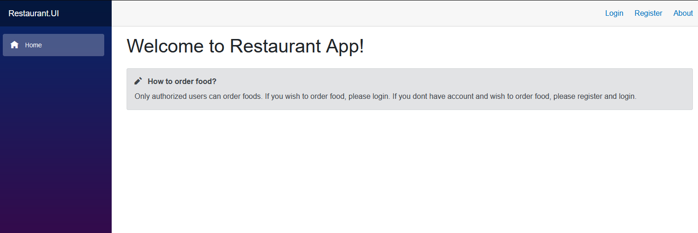

# Project_Restaurant_Blazor
> Project Restaurant Backend Net 7 Frontend Blazor

# General info
Project_Restaurant_Blazor contains two applications: server and client. Server was written in .Net 7, client Blazor. Project simulate simple ordering foods. Priveledged users can add / remove food and logged users can order it. Client and server shares data via gRPC Web protocol. 

# Server application 
Server was divided into 7 projects including tests projects: Api, Application, Core, Infrastructure, Migrations. Api project has configure the whole project. Application contains business logic. Infrastructure has gRPC services, database connection, services that typically talk to external resources. Core contains domain model and Migrations has infomrations about database scheme. On start application when database scheme changed, FluentMigrator using Migrations project migrate database scheme. Project has also integration and unit tests.

# Shared project
Project was created to contains common data which could be used by backend and frontend like for example gRPC proto files. They are used to communicate with backend with frontend and vice versa.

# Client
Client application was written using C# and Blazor library. Project also contains unit tests, which tests pages and components. Client project structure divide into components, and pages. Components dont have specific logic, the logic is dedidcaded only to pages. For better testing created interfaces which send receive data from backend using gRPC Web protocol. Unit tests was written using bUnit library.

# Technologies
- Net 7
- MySQL
- Dapper
- Blazor
- gRPC
- xUnit
- bUnit
- Shouldly

# Screens

  

  

  

  

  

  

  

  

  

  

